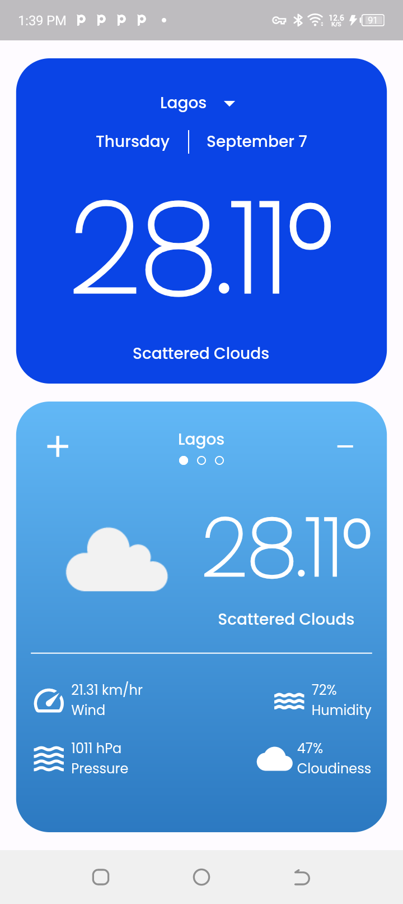

# Weather App

A simple flutter app that displays the weather of a city.

## Description

The Weather App is a simple flutter app that displays the weather of a city. It uses
the [OpenWeatherMap API](https://openweathermap.org/api) to fetch the weather data.

## Features

- Allows the user to see the weather of predefined cities
- Allows the user to add a carousel of cities to view their weather
- Allows the user to see the weather of their current location

## Screenshot

The apk to the app can be found in the actions tab

Watch the app in action by clicking on the screenshot below:

[](screenshots/screenrecording.mp4 "App Demo")

## Installation

Clone the repository from Github:

``` bash
git clone https://github.com/logickoder/payment_app_auth_ui.git
```

Navigate to the project directory:

``` bash
cd weather
```

Create an env file with your OpenWeatherMap API key:

``` bash
echo "WEATHER_API_KEY=<YOUR_API_KEY>" > .env
```

Run the app on your emulator or physical device:

```arduino
flutter run
```

## Requirements

- Flutter installed on your system
- Emulator or physical device for testing

## Contributing

Contributions are welcome! Please feel free to fork the repository and submit pull requests. Make
sure to follow the existing code conventions and try to include tests with your changes.

## License

This project is licensed under the MIT License - see the LICENSE.md file for details.